# Budget Tracker — Design Brief

Dokumen ini isinya **semua halaman, sheet, komponen, dan fitur** yang ada di aplikasi
sekarang, buat jadi bahan revamp desain. Ditulis dari kode yang lagi jalan (bukan dari
rencana), jadi apa yang ada di sini memang yang tampil di layar hari ini.

- **Platform:** web app, **mobile-first**, dipasang sebagai PWA (installable). Lebar konten
  dikunci di `max-width: 42rem` (672px) dan di-center — jadi di desktop tampilannya tetap
  kolom tunggal ala mobile.
- **Bahasa UI:** Indonesia, gaya santai (bukan bahasa bank).
- **User:** single-user. Nggak ada halaman sign-up, nggak ada onboarding multi-step.
- **Timezone & mata uang:** Asia/Jakarta, Rupiah penuh (tanpa sen, tanpa desimal).

> **Screenshot di dokumen ini diambil dari aplikasi yang beneran jalan**, lebar 390px
> (ukuran iPhone 14), dengan data contoh yang angkanya sengaja dibikin konsisten secara
> aritmetika — jadi rumus di layar Minggu & Bulan memang benar-benar nyambung. Tiap gambar
> menampilkan **seluruh tinggi layar** (bukan cuma yang kelihatan tanpa scroll), makanya
> beberapa terlihat panjang. File aslinya ada di `docs/screenshots/`.

---

## 1. Konsep produk (wajib dibaca desainer dulu)

Aplikasinya bukan pencatat pengeluaran biasa. Premisnya:

> **Budget weekend itu hasil dari disiplin weekday.**

Cara hitungnya:

1. Budget bulanan dibagi rata ke **jumlah hari weekday (Sen–Jum)** → dapat **jatah harian**.
2. Sisa jatah weekday yang nggak kepakai **jadi budget weekend** minggu itu.
3. Sisa akhir minggu **di-rollover** ke minggu berikutnya; sisa akhir bulan di-rollover ke
   bulan berikutnya.
4. Boros hari Selasa → weekend otomatis menyempit. Hemat hari Selasa → weekend melebar.

Konsekuensi desain yang penting:

- **Angka boleh minus.** Aplikasi nggak pernah menolak pengeluaran yang melebihi budget.
  Defisit ikut di-rollover. Di UI ditandai merah **dan** label teks `OVER` — warna nggak
  pernah jadi satu-satunya sinyal.
- **Rantai perhitungan harus kelihatan**, bukan cuma hasil akhirnya. Makanya ada pola
  "struk" (receipt) di beberapa layar: daftar baris yang saling menambah/mengurangi sampai
  ketemu total.

### Dua jenis dompet (wallet)

Satu akun punya banyak dompet. **Tipe dompet menentukan isi seluruh aplikasi** — tab bar,
angka, bahkan pertanyaan yang dijawab layar Home.

| | `DATE_BUDGET` (default, nama "Kencan") | `SAVINGS` (Tabungan) |
|---|---|---|
| Pertanyaan utama | "Masih boleh ngeluarin berapa?" | "Masih harus nabung berapa?" |
| Punya budget bulanan | ✅ | ❌ |
| Punya segmen mingguan | ✅ | ❌ |
| Punya target & tenggat | ❌ | ✅ |
| Saldo boleh minus | ✅ (defisit di-rollover) | ❌ (saldo itu fakta, bukan rencana) |
| Aksi utama | Catat pengeluaran | Setor · Tarik |

**Wallet switcher ada di header semua layar**, karena ganti dompet = ganti arti seluruh
layar. URL-nya nggak berubah: `/` artinya "home dompet ini", `/month` artinya "bulan dompet
ini".

---

## 2. Sitemap & navigasi

```
/login                        ← di luar shell, nggak ada tab bar

(butuh login, semua di dalam AppShell)
/                             Home          — beda isi per tipe dompet
/week                         Minggu        — DATE_BUDGET only (SAVINGS → redirect ke /)
/month                        Bulan         — beda isi per tipe dompet
/budget                       Budget        — DATE_BUDGET only (SAVINGS → redirect ke /)
/expenses                     Riwayat       — dipakai dua tipe dompet
/expenses/:id                 Detail pengeluaran
/settings                     Pengaturan

(route yang tampil sebagai sheet di atas layar yang lagi kebuka)
/expenses/new                 Sheet: Catat pengeluaran
/savings/deposit              Sheet: Setor
/savings/withdraw             Sheet: Tarik
```

### Bottom tab bar

Semua navigasi ada **di bawah** — alasannya cuma satu region itu yang kejangkau jempol
tanpa harus mindahin pegangan HP. Tombol aksi **masuk ke dalam bar**, nggak floating di
atas list (FAB yang ngambang selalu nutupin baris terakhir, yang justru angkanya mau
dibaca).

**Dompet `DATE_BUDGET`** — 4 tab + 1 tombol aksi:

| Tab | Label | Ikon (lucide) |
|---|---|---|
| 1 | Home | `Home` |
| 2 | Minggu | `CalendarDays` |
| 3 | Bulan | `PieChart` |
| 4 | Riwayat | `Receipt` |
| + | Catat pengeluaran (aksen, primary) | `Plus` |

**Dompet `SAVINGS`** — 3 tab + 2 tombol aksi:

| Tab | Label | Ikon |
|---|---|---|
| 1 | Home | `Home` |
| 2 | Riwayat | `Receipt` |
| 3 | Bulan | `PieChart` |
| + | **Setor** (hijau/positif) | `ArrowDownToLine` |
| + | **Tarik** (sekunder, outline) | `ArrowUpFromLine` |

Dua aksi terpisah, bukan satu tombol dengan chooser — biar aksi yang jujur (mencatat
penarikan) nggak jadi aksi yang lebih lambat.

### Header (`PageHeader`) — ada di semua layar

Susunannya: **eyebrow** (label mono kecil, uppercase — biasanya tanggal/periode) → **judul**
(serif Fraunces, 24px) → **subtitle** opsional. Di kanan: wallet switcher, tombol aksi
kontekstual (opsional), toggle tema (`Sun`/`Moon`), dan ikon Pengaturan (`Settings`).

Di halaman Pengaturan, chrome kanan dimatikan (switcher & ikon settings nggak tampil).

---

## 3. Daftar halaman

### 3.1 Login — `/login`

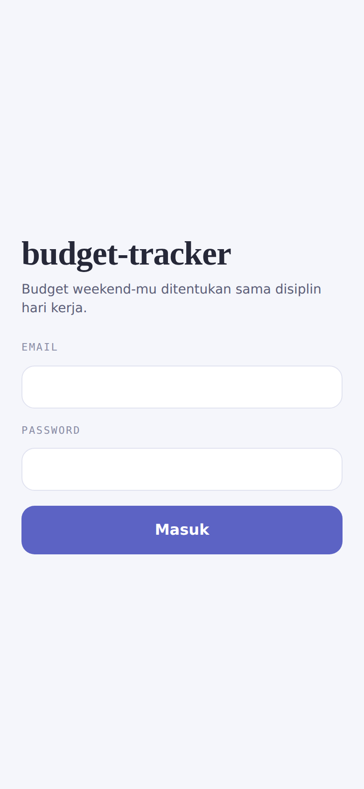

Layar paling sederhana. **Nggak ada tombol daftar, nggak ada "lupa password"** — akun
dibuat lewat CLI.

- Field: **Email**, **Password**
- Tombol: **Masuk**
- State: loading, error (pesan dari server), rate-limited (login dibatasi)

---

### 3.2 Home / Hari ini — `/` (dompet `DATE_BUDGET`)

| Normal | Belum ada budget | Mode gelap |
|---|---|---|
| 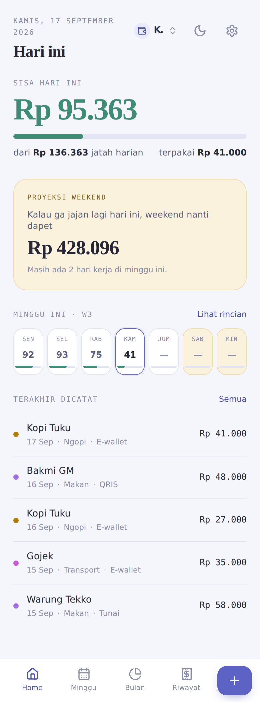 | 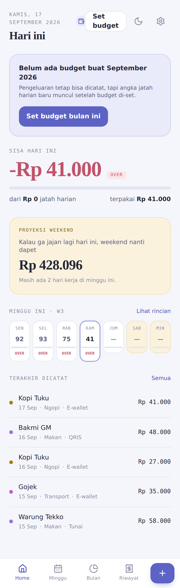 | 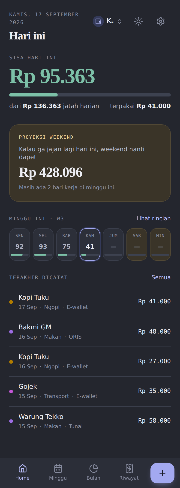 |

Layar yang paling sering dibuka. Menjawab satu pertanyaan dulu — *"sekarang boleh jajan
berapa?"* — lalu langsung nunjukin apa hasilnya buat weekend.

Isi dari atas ke bawah:

1. **Header** — eyebrow: tanggal panjang (mis. "Senin, 16 September 2026"), judul: "Hari ini".
   Kalau bulan ini belum ada budget, muncul tombol **Set budget** di header.
2. **Notice "belum ada budget"** (kondisional) — kartu aksen: *"Belum ada budget buat
   September 2026 · Pengeluaran tetap bisa dicatat, tapi angka jatah harian baru muncul
   setelah budget di-set"* + tombol **Set budget bulan ini**.
3. **Hero** — angka terbesar di aplikasi. **Tanpa kartu, tanpa border, tanpa shadow** —
   nempel langsung di background. Ini disengaja: kalau semua blok dikasih kotak, nggak ada
   yang lebih penting dari yang lain. Label: "Sisa hari ini". Di weekday isinya jatah hari
   ini; di weekend isinya sisa budget weekend.
4. **Kartu proyeksi weekend** — pakai **ButterCard** (warna butter/kuning; butter cuma
   dipakai buat weekend, nggak pernah buat hal lain). Kalimatnya berbentuk konsekuensi,
   bukan statistik: *"kalau nggak jajan lagi hari ini, weekend dapat Rp X"*.
5. **Week strip** — 7 hari dalam satu baris. Tiap hari: label hari pendek + bar meter.
   Hari weekend dapat permukaan butter; bar di dalamnya bawa tone aman/warning/over.
6. **Terakhir dicatat** — 5 pengeluaran terakhir + link **Lihat rincian** / **Semua**.
   Empty state: "Belum ada pengeluaran".

---

### 3.3 Minggu — `/week` (dompet `DATE_BUDGET`)

| Terang | Gelap |
|---|---|
| 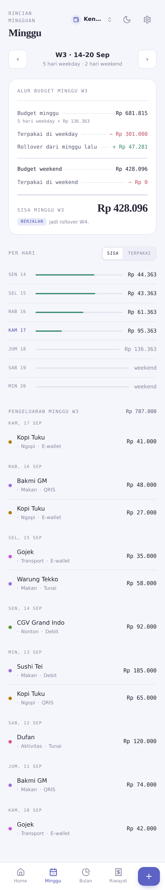 | 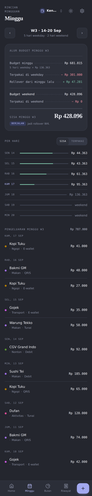 |

Header: eyebrow "Rincian mingguan", judul "Minggu".

1. **Stepper minggu** — `‹` / `›` dengan label di tengah: `W2 · 8–14 Sep` dan baris kecil
   "5 hari weekday · 2 hari weekend". Satu bulan punya 4–6 segmen minggu (Sen–Min, dipotong
   di batas bulan).
2. **Status badge** — `Berjalan` / `Selesai` / `Akan datang`.
3. **Kartu struk (ReceiptCard)** — komponen paling khas di aplikasi ini. Set pakai font
   **mono**, tiap baris punya *dotted leader* dari label ke angka. Barisnya:

   ```
   Budget minggu (5 × 100rb) .............. Rp 500.000
   Terpakai di weekday ................... − Rp  93.000
   Rollover dari minggu lalu ............. + Rp  40.000
   Dipindah ke dompet lain ............... − Rp 320.000   (cuma tampil kalau ada)
   Masuk dari dompet lain ................ + Rp       0   (cuma tampil kalau ada)
   ────────────────────────────────────────────────────
   Budget weekend ......................... Rp 127.000
   Terpakai di weekend ................... − Rp  85.000
   ════════════════════════════════════════════════════
   Sisa ................................... Rp  42.000
   ```

   Baris transfer sengaja dapat baris sendiri — uang yang dipindah ke tabungan itu bukan
   uang yang dibelanjakan, tapi tetap motong budget weekend minggu itu. Baris yang nilainya
   nol nggak ditampilkan.
4. **Kalimat penutup** — ke mana sisanya pergi ("Rollover ke minggu depan …").
5. **Per hari** — 7 baris: label hari · bar meter · angka. Ada **toggle segmented
   `Sisa` / `Terpakai`** yang menentukan arti kolom angka (default: `Sisa`).

---

### 3.4 Bulan — `/month` (dompet `DATE_BUDGET`)

| Terang | Gelap |
|---|---|
| 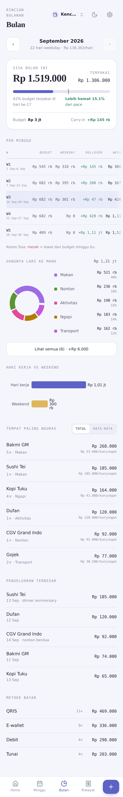 | 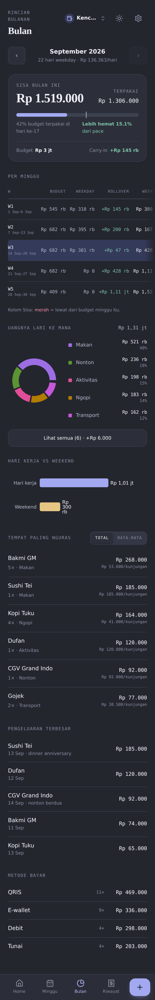 |

Layar paling padat. Ini satu-satunya layar yang pakai charting (Recharts, di-lazy-load).

Header: eyebrow "Rincian bulanan", judul "Bulan". Stepper bulan dengan sub-label
"22 hari weekday · Rp 113.636/hari". Tombol `›` disabled kalau sudah di bulan berjalan.

Kartu/section-nya berurutan:

1. **Summary card** — Budget · Carry-in · Terpakai · **Sisa bulan ini** (angka besar).
   Kalau belum ada budget: *"Bulan ini belum ada budget"* + tombol **Set budget**.
2. **Per minggu** — *tabel terpenting di aplikasi.* Kolomnya persis mengikuti urutan
   perhitungan, dan **scroll horizontal** (bukan wrap), karena kalau barisnya dilipat,
   pembacaan kiri-ke-kanan rumusnya hancur. Ada mask gradient di tepi kanan sebagai
   penanda masih ada kolom lagi.
3. **Uangnya lari ke mana** — **donut chart** per kategori. Tiap slice dipisah gap
   sewarna surface. Legenda di sampingnya menyebut nama kategori + nominal + persentase —
   identitas slice nggak pernah cuma bergantung ke warna. Tiap baris legenda bisa di-tap →
   ke Riwayat dengan filter kategori itu.
4. **Hari kerja vs weekend** — bar chart dua batang (Weekday / Weekend), + label
   "Lebih hemat" / "Lebih boros".
5. **Tempat paling nguras** — ranking merchant. Ada **toggle `Total` / `Rata-rata`**, karena
   dua-duanya jawab pertanyaan beda: warung murah yang didatangi 10× menang di total,
   sedangkan satu dinner mahal menang di rata-rata. Ada tombol **Ciutkan** buat ngelipat
   list. Baris bisa di-tap → Riwayat terfilter merchant. Item tanpa merchant: "Tanpa tempat".
6. **Pengeluaran terbesar** — daftar transaksi terbesar bulan itu.
7. **Metode bayar** — breakdown per metode (Cash, QRIS, Debit, Credit, Transfer, E-wallet,
   Lainnya).

Empty state: "Belum ada pengeluaran bulan ini", "Belum ada tempat tercatat".

---

### 3.5 Budget — `/budget` (dompet `DATE_BUDGET`)

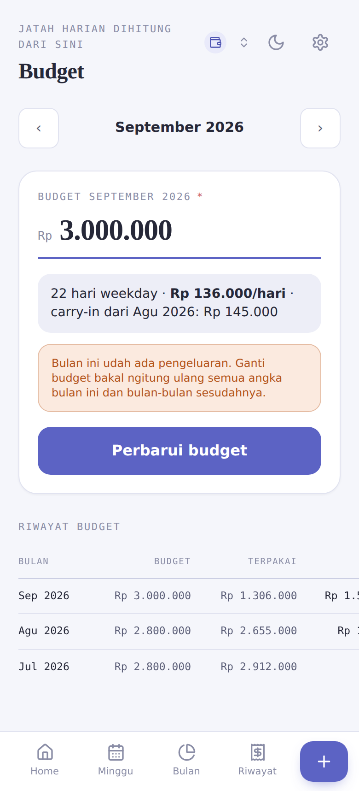

Header: eyebrow "Jatah harian dihitung dari sini", judul "Budget". Stepper bulan.

1. **Kartu input** — field nominal besar (32px, serif, tabular) dengan prefix `Rp` mono dan
   underline aksen tebal. Keyboard numerik, auto-format ribuan saat ngetik.
2. **Preview langsung** — begitu angka diisi: *"22 hari weekday · **Rp 113.636/hari** ·
   carry-in dari Agt: Rp 40.000"*. Angka harian harus kelihatan **sebelum** disimpan.
3. **Tombol** — **Simpan budget** / **Perbarui budget** (berubah kalau bulan itu sudah punya
   budget).
4. **Riwayat budget** — list bulan-bulan sebelumnya: periode · Budget · Terpakai · Sisa.
   Empty state: "Belum ada budget tersimpan".

---

### 3.6 Riwayat — `/expenses` (dua tipe dompet)

| Dompet kencan | Dompet tabungan |
|---|---|
| 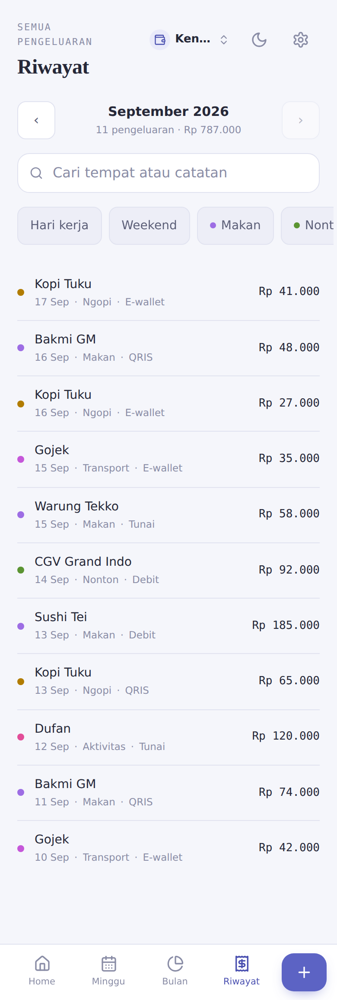 | 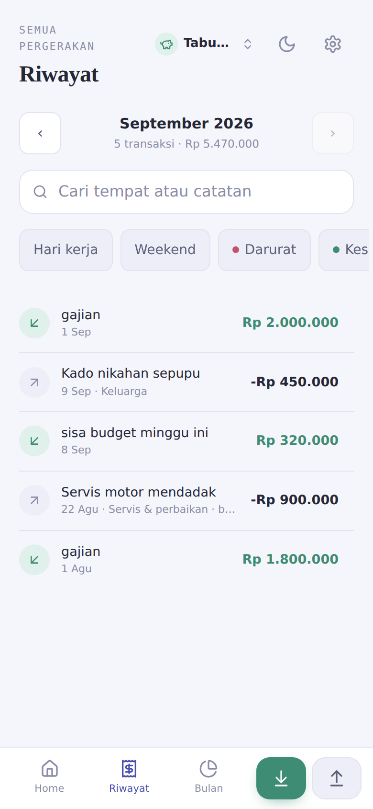 |

Satu layar yang melayani dua tipe dompet. Yang beda cuma bentuk barisnya dan kosakata
kategorinya.

1. **Stepper bulan** (`‹` `›`).
2. **Search** — placeholder "Cari tempat atau catatan", debounce 300ms.
3. **Chip row kategori** — scroll horizontal, chip warna kategori. Kategori terpilih
   auto-scroll ke tengah (penting karena user bisa mendarat di sini dari donut bulanan).
   Kategori yang sudah diarsip tetap bisa jadi filter aktif (tampil sebagai pill terpisah).
4. **Filter jenis hari** — Weekday / Weekend.
5. **List** — infinite scroll (IntersectionObserver), dikelompokkan per tanggal.
6. **Filter disimpan di URL** — jadi hasil tap-through dari dashboard bulanan bisa
   di-bookmark atau dikirim ke orang.

**Baris pengeluaran (DATE_BUDGET):** headline-nya **nama tempat** (itu yang diingat orang),
kalau kosong diganti nama kategori. Ada dot warna kategori, metode bayar, nominal.

**Baris tabungan (SAVINGS):** penarikan headline-nya **alasan**; setoran headline-nya
catatan atau kata "Setoran". Badge `Utang` / `Lunas` buat penarikan yang ditandai bakal
dibalikin. Tap → buka **sheet edit** (bukan halaman detail).

Empty state: "Belum ada pengeluaran bulan ini" / "Belum ada pergerakan bulan ini" /
"Ga ada yang cocok" (kalau lagi ada filter).

---

### 3.7 Detail pengeluaran — `/expenses/:id` (DATE_BUDGET)

| Detail (baca) | Sheet edit |
|---|---|
| 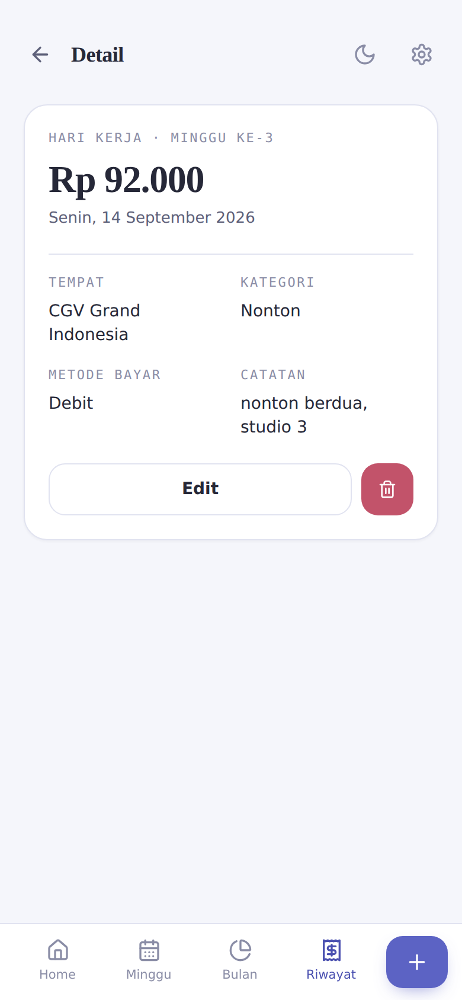 | 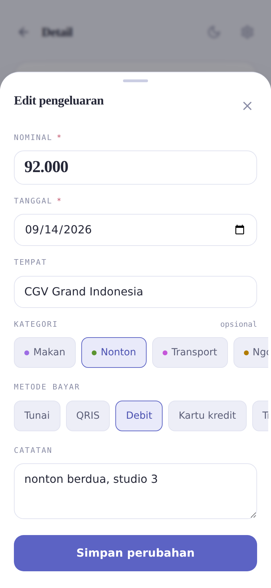 |

Halaman penuh (bukan sheet), dengan tombol `‹ Kembali` di kiri atas. Isinya **kartu baca**,
bukan form — form-nya baru muncul sebagai sheet setelah tombol **Edit** ditekan.

- Eyebrow mono: `HARI KERJA · MINGGU KE-3`
- Nominal besar + tanggal panjang
- Grid 2 kolom: **Tempat** · **Kategori** · **Metode bayar** · **Catatan**
- Tombol **Edit** (lebar) + tombol hapus merah (ikon tong sampah) di sebelahnya
- Section **Struk · N** — grid thumbnail foto struk, tiap foto bisa dibuka full & dihapus
  (tidak tampil di screenshot karena data contohnya tanpa foto)
- Sheet **Edit pengeluaran**: Nominal · Tanggal · Tempat · Kategori (chip) ·
  Metode bayar (chip) · Catatan · tombol **Simpan perubahan**
- Dialog konfirmasi **"Hapus pengeluaran?"**
- Toast: "Perubahan tersimpan" / "Pengeluaran dihapus"

---

### 3.8 Home Tabungan — `/` (dompet `SAVINGS`)

| Ada target | Belum ada target | Mode gelap |
|---|---|---|
| 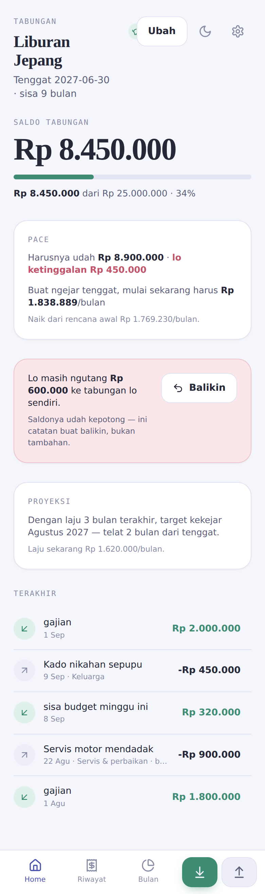 | 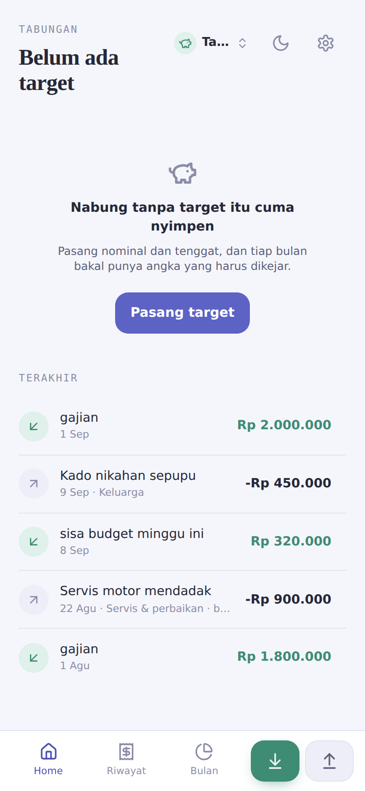 | 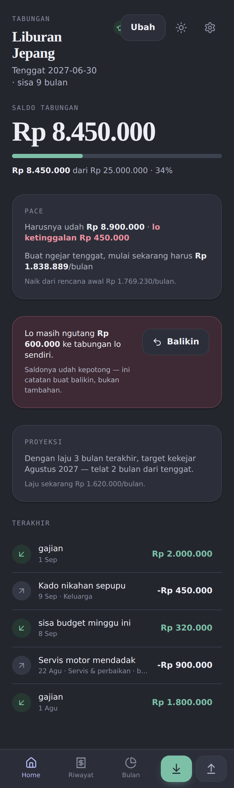 |

Cermin dari Home dompet kencan. Yang satu nanya "boleh ngeluarin berapa", yang ini nanya
"masih harus nabung berapa".

**Kalau belum ada target** — empty state penuh: ikon `PiggyBank`, judul *"Nabung tanpa
target itu cuma nyimpen"*, deskripsi, tombol **Pasang target**. Di bawahnya tetap ada
riwayat pergerakan.

**Kalau sudah ada target:**

1. **Header** — eyebrow "Tabungan", judul = nama target (mis. "Liburan Jepang"),
   subtitle "Tenggat 2027-03-01 · sisa 6 bulan" (atau "udah lewat N hari"). Tombol **Ubah**.
2. **Hero** — "Saldo tabungan", angka besar tanpa kartu. **Ini saldo apa adanya**, bukan
   saldo dikurangi utang — uangnya memang sudah keluar dan saldo sudah mencerminkan itu.
3. **Kartu Pace** — seberapa on-track. Pakai warna semantik (positif/negatif), **bukan warna
   aksen** — ini pembacaan tentang uang, bukan identitas aplikasi. Baris kedua yang paling
   penting: cicilan bulanannya **naik** jadi berapa, dari berapa.
4. **Kartu Utang ke diri sendiri** (kondisional) — muncul kalau ada penarikan bertanda
   "bakal gw balikin" yang belum lunas. Warna `--neg-soft`, **bukan merah penuh** — ini
   pengingat, bukan alarm; uangnya diambil sadar dan ditandai sendiri. Ada tombol buat
   langsung setor pelunasan.
5. **Kartu Proyeksi** — kalau ritme sekarang diteruskan, targetnya kekejar kapan.
6. **Terakhir** — 5 pergerakan terakhir. Empty: "Belum ada pergerakan".

---

### 3.9 Bulan Tabungan — `/month` (dompet `SAVINGS`)

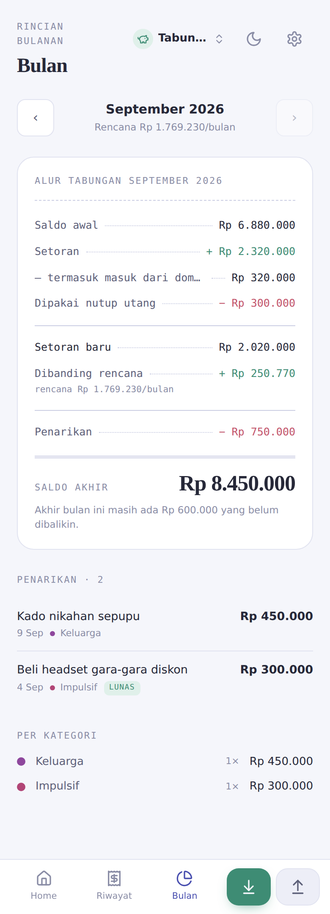

Pakai **kartu struk yang sama** dengan minggu-nya dompet kencan — format itu sudah terbukti
kebaca sekilas, bikin bahasa visual kedua buat ide yang sama justru lebih buruk.

1. Stepper bulan, eyebrow "Rincian bulanan", judul "Bulan".
2. **Kartu struk:**

   ```
   Saldo awal ............................. Rp 4.000.000
   Setoran ............................... + Rp 2.000.000
     — termasuk masuk dari dompet lain ...   Rp   500.000
   Dipakai nutup utang ................... − Rp   600.000
   Setoran baru ........................... Rp 1.400.000   ← ini yang ngukur progres
   Penarikan ............................. − Rp   300.000
     — termasuk pindah ke dompet lain ....   Rp         0
   ════════════════════════════════════════════════════
   Saldo akhir ............................ Rp 5.100.000
   Dibanding rencana ...................... + Rp   200.000
   ```

   "Setoran baru" itu angka kuncinya: setoran yang cuma nambal penarikan lama menggerakkan
   saldo tapi **tidak** menggerakkan target.
3. **Penarikan** — list satu baris per penarikan, **alasan sebagai headline**, ditaruh
   **sebelum** breakdown kategori dan bukan berupa donut. Yang dicari orang waktu buka layar
   ini adalah *kalimat*, bukan persentase. Badge `Utang` / `Lunas`. Kalau kosong:
   "Nggak ada penarikan bulan ini".
4. **Per kategori** — breakdown kategori penarikan, ditaruh paling bawah.

---

### 3.10 Pengaturan — `/settings`

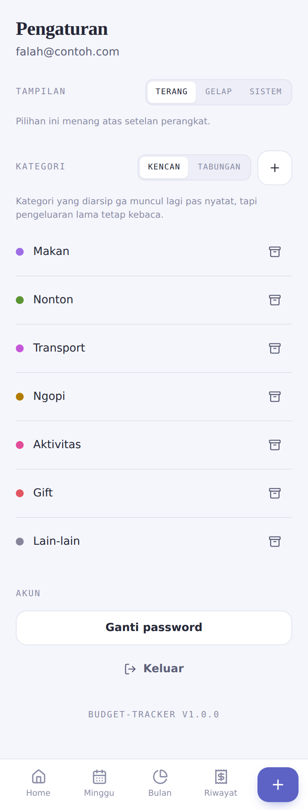

Header: judul "Pengaturan", subtitle = email user. Chrome kanan dimatikan.

1. **Tampilan** — segmented `Terang` / `Gelap` / `Sistem` + kalimat penjelas ("Ikut setelan
   perangkat — sekarang gelap" / "Pilihan ini menang atas setelan perangkat").
2. **Kategori** — segmented scope **`Kencan` / `Tabungan`** (dua kosakata kategori yang
   benar-benar terpisah; nama yang sama boleh ada di dua-duanya) + tombol `+`.
   List kategori: dot warna · nama · aksi arsip. Kategori **diarsip, nggak dihapus** —
   pengeluaran lama tetap kebaca.
   Sheet **Kategori baru** / **Kategori penarikan baru**: field **Nama** + picker **Warna**.
3. **Akun** — **Ganti password** (sheet: password sekarang + password baru; catatan *"Semua
   perangkat yang lagi login bakal ikut keluar"*) dan **Keluar**.

---

## 4. Sheet, dialog & overlay

Semua sheet muncul **di atas** layar yang lagi kebuka, bukan menggantikannya — biar angka
yang lagi jadi dasar keputusan tetap kelihatan di belakang. Radius sheet `28px`, dan layar
di belakangnya di-blur.

| Catat pengeluaran | Setor | Tarik |
|---|---|---|
| 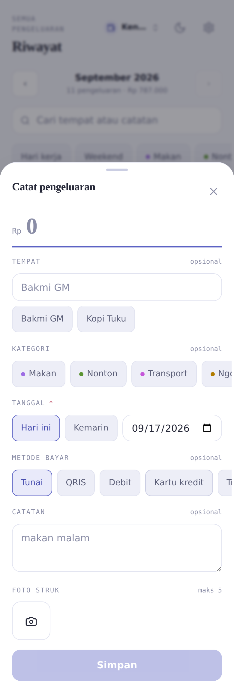 | 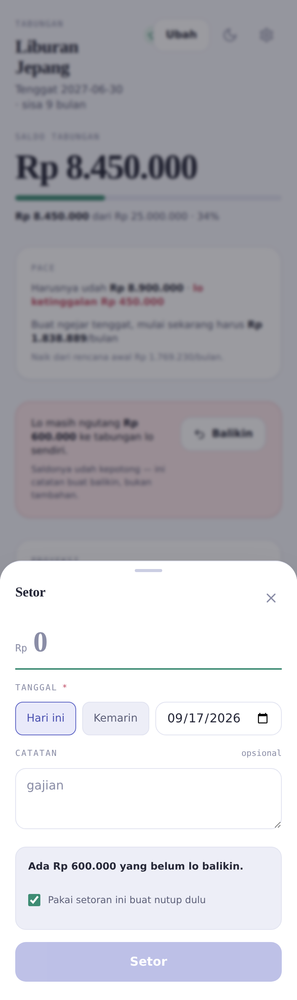 | 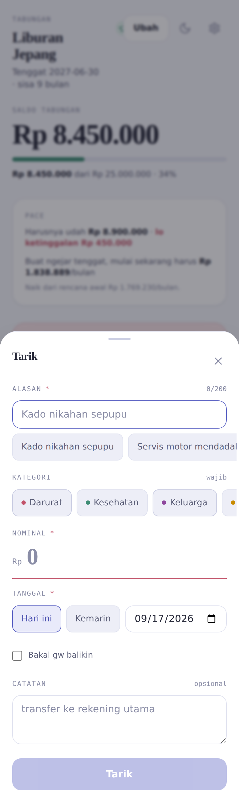 |

| Dompet (switcher) | Pindah uang |
|---|---|
| 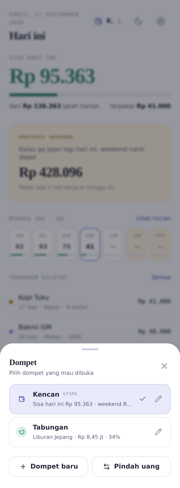 | 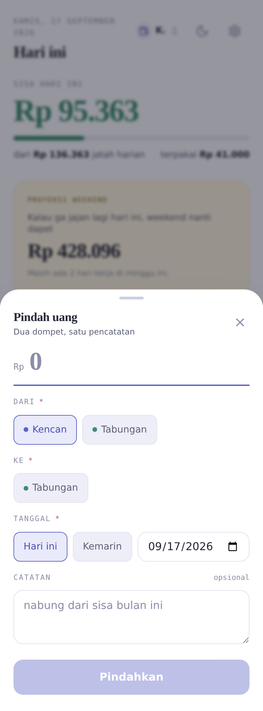 |

| Sheet | Dibuka dari | Isi |
|---|---|---|
| **Catat pengeluaran** | tombol `+` tab bar / `/expenses/new` | Urutan field mengikuti kecepatan input, bukan kerapian data model: **Nominal** (autofocus, keyboard numerik) → **Tempat** (autocomplete; pilih tempat yang sudah dikenal otomatis ngisi kategori + metode bayar) → **Kategori** → **Metode bayar** → **Tanggal** → **Catatan** → **Foto struk**. Target: < 20 detik. |
| **Setor** | tombol Setor / `/savings/deposit` | **Nominal** (autofocus) · **Tanggal** · **Catatan**. Kalau ada utang belum lunas, tumbuh blok alokasi pelunasan: default FIFO tapi **tiap baris bisa diubah manual** (bayar utang terbaru dulu itu pilihan yang sah). |
| **Tarik** | tombol Tarik / `/savings/withdraw` | **Alasan dulu, autofocus, sebelum nominal** — ini inti fiturnya. Lalu **Nominal** · **Tanggal** · **Kategori** · **Catatan** · checkbox "bakal gw balikin". |
| **Dialog friksi penarikan** | sebelum simpan Tarik | Nunjukin **biaya penarikan dalam satuan waktu** ("target mundur X bulan", "cicilan naik jadi Rp Y"). Angkanya dari server, nggak pernah dihitung di browser. **Friksi, bukan blokir**: `Batal` di kiri dan nggak di-emphasize, tapi **Lanjut tarik** selalu satu tap — penarikan yang ditolak aplikasi = penarikan yang terjadi di luar aplikasi dan nggak tercatat sama sekali. |
| **Pasang / Ubah target** | Home tabungan | **Nama target** · **Target nominal** · **Saldo awal** · **Mulai** · **Tenggat** · **Catatan**. Cicilan per bulan **nggak pernah diketik manual** — diturunkan server dan dikunci; sheet-nya bilang ini terang-terangan. |
| **Ubah setoran / Ubah penarikan** | tap baris di Riwayat (dompet tabungan) | **Nominal** · **Alasan** (penarikan) · **Tanggal** · **Catatan** + tombol **Hapus**. |
| **Dompet** (switcher) | header semua layar | List dompet; tiap baris bawa **ringkasan dalam kosakata tipenya sendiri** (dompet kencan: sisa bulan ini; tabungan: progres target). Tiap baris punya tombol pensil buat rename terpisah, karena tap di nama harus tetap berarti "buka dompet ini". Tombol **Bikin dompet**. |
| **Dompet baru** | dari switcher | **Nama** · **Tipe** (Kencan / Tabungan). Tipe dikunci setelah dibuat. |
| **Ubah nama dompet** | ikon pensil di switcher | Cuma field **Nama**. Tombol disabled kalau nama nggak berubah. |
| **Pindah uang** (transfer) | tombol **Pindah uang** di sheet Dompet | **Dari** · **Ke** · **Nominal** · **Tanggal** · **Catatan**. Catatan di bawah nominal adalah inti fiturnya: transfer keluar dari dompet kencan **motong budget weekend minggu itu**, dan formnya bilang duluan. |
| **Ganti password** | Pengaturan | Password sekarang · Password baru. |
| **Kategori baru** | Pengaturan / chip "+ Baru" di picker | Nama + warna. Dari picker cukup nama doang (warna dipilih server) biar keyboard nggak perlu ditutup di tengah input. |
| **Hapus pengeluaran?** | Detail pengeluaran | Dialog konfirmasi. |
| **Toast** | global (sonner) | "Kategori ditambahkan", "Perubahan tersimpan", "Target dipasang", "Foto gagal diupload" + tombol "Coba lagi", dll. |

---

## 5. Komponen UI yang sudah ada

Ini inventaris komponen sekarang — buat referensi, bukan batasan. Kalau ada yang menurut
desainer lebih baik dilebur/dipecah, silakan.

**Layout & frame**
`AppShell` (frame + bottom nav) · `PageHeader` (eyebrow/title/subtitle/action) ·
`HeaderChrome` (toggle tema + ikon settings) · `SectionHead` · `SectionLink`

**Container**
`Card` · `ButterCard` (varian butter, khusus weekend) · `CardHeader` · `Sheet` (bottom sheet)

**Kontrol**
`Button` (varian: primary/secondary/ghost; ukuran: sm/md/icon) · `StepButton` (`‹` `›`
persegi & kalem — mindahin periode, nggak pernah jadi aksi utama layar) · `Segmented`
(toggle 2–3 pilihan) · `Chip` / `ChipRow` / `ChipWrap` · `Input` · `Textarea` · `Field`
(label + wrapper)

**Uang & status**
`Money` (nominal + tone) · `MoneyHero` (angka besar Fraunces, tabular, nempel di ground) ·
`OverBadge` (label teks `OVER`) · `StatusBadge` (Berjalan/Selesai/Akan datang, Utang/Lunas) ·
`Meter` (bar proporsi)

**Struk**
`ReceiptCard` · `ReceiptLine` (label + dotted leader + angka bertanda) · `ReceiptRule` ·
`ReceiptTotal`

**State**
`Spinner` · `LoadingBlock` · `Skeleton` · `EmptyState` (ikon + judul + deskripsi + aksi) ·
`ErrorState` (pesan + tombol coba lagi)

**Chart** — Recharts, cuma di layar Bulan: donut kategori, bar weekday vs weekend.

**Ikon** — `lucide-react`. Kategori & dompet menyimpan nama ikon lucide di database.

---

## 6. Design token sekarang

Tema: **"Periwinkle & Butter"**. Punya mode terang & gelap penuh, plus opsi "ikut sistem".
Semua token di bawah ini bebas diganti — tapi tolong tetap sediakan padanannya di dua mode.

### Warna (mode terang → gelap)

| Token | Terang | Gelap | Fungsi |
|---|---|---|---|
| `--bg` | `#F5F6FB` | `#24262E` | background halaman (netral dibias biru-violet) |
| `--surface` | `#FFFFFF` | `#2C2F39` | permukaan kartu |
| `--surface-2` | `#EDEEF7` | `#343845` | cekungan: track meter, chip |
| `--surface-3` | `#E3E5F2` | `#3D4250` | cekungan lebih dalam |
| `--border` | `#E1E3F0` | `#3A3E4B` | garis |
| `--border-strong` | `#CBCEE3` | `#4B5060` | garis tegas |
| `--text` | `#262838` | `#EDEEF4` | teks utama |
| `--text-2` | `#5D6079` | `#B0B4C4` | teks sekunder |
| `--text-3` | `#8A8DA6` | `#868B9E` | label mikro & empty state |
| `--accent` | `#5C63C4` | `#A3A9F0` | aksen (periwinkle) |
| `--accent-ink` | `#4A50B0` | `#B7BCF7` | aksen sebagai teks di atas surface |
| `--accent-soft` | `#E9EAFA` | `#343A5A` | latar aksen lembut |
| `--butter` | `#E0B65C` | `#E7C583` | **khusus weekend** |
| `--butter-soft` | `#FBF2DE` | `#3A3428` | latar butter |
| `--pos` | `#3E8C74` | `#7CC0A7` | positif / setoran |
| `--neg` | `#C2536A` | `#EC8FA0` | negatif / over |
| `--neg-soft` | `#FBE7EA` | `#3E2A34` | pengingat lembut (utang ke diri sendiri) |

**Palet kategori** — 5 slot chart (`--cat-1`..`--cat-5`) + palet kategori default yang
disimpan per user sebagai hex. Aturannya keras: **tiap warna harus lolos kontras 3:1 di
permukaan paling terang (`#FFFFFF`) DAN paling gelap (`#2C2F39`) sekaligus**, dan jarak
antar warna tetangga minimal ΔE 19 di CIE Lab. Kalau paletnya diganti, aturan ini harus
tetap dipenuhi.

Kategori default dompet kencan: Makan · Nonton · Transport · Ngopi · Aktivitas · Gift ·
Lain-lain.
Kategori penarikan tabungan: Darurat · Kesehatan · Keluarga · Servis & perbaikan ·
Elektronik · **Impulsif** · Lain-lain.

### Tipografi

| Token | Font | Dipakai buat |
|---|---|---|
| `--f-display` | **Fraunces** (serif) | semua **nominal uang** & judul halaman |
| `--f-ui` | **Public Sans** | seluruh UI |
| `--f-mono` | **IBM Plex Mono** | struk, label mikro, eyebrow |

Serif di angka uang itu inti sistem tipografinya: bikin nominal kebaca sebagai sesuatu yang
**personal**, bukan baris di laporan korporat. Angka uang selalu **tabular**.

### Radius · shadow · motion

| Token | Nilai | Untuk |
|---|---|---|
| `--r-xs` | 6px | badge, chip di dalam chip |
| `--r-sm` | 10px | tombol kecil, segmented |
| `--r-md` | 14px | field, tombol utama |
| `--r-lg` | 20px | card |
| `--r-xl` | 28px | bottom sheet |
| `--shadow-sm/md/lg` | — | 3 tingkat |
| `--t-fast / base / slow` | 140 / 240 / 420 ms | durasi |
| `--ease-out` | `cubic-bezier(.2,.8,.2,1)` | default |
| `--ease-spring` | `cubic-bezier(.22,1,.36,1)` | tombol aksi |

Interaksi sekarang: tab & tombol `active:scale-95`, tombol aksi `hover:-translate-y-px` +
`active:scale-[0.93]`, bottom nav pakai `backdrop-blur(16px)` di atas surface 92%.

---

## 7. Aturan yang nggak boleh hilang di revamp

Ini bukan preferensi estetik — ini aturan yang bikin produknya benar:

1. **Warna nggak pernah jadi satu-satunya sinyal.** Angka minus selalu bawa label teks
   `OVER`. Slice donut selalu dinamai di legenda beserta nominal & persentasenya.
2. **Kontras kategori di dua tema.** Warna kategori disimpan sebagai hex per user — satu
   nilai harus kerja di mode terang dan gelap sekaligus (3:1 di dua-duanya).
3. **Hero angka nggak dikasih kotak.** Kalau semua blok dapat kartu, nggak ada yang
   outrank apa pun.
4. **Butter cuma buat weekend.** Nggak pernah dipakai buat hal lain.
5. **Struk tetap berupa running total.** Poinnya bikin rantai perhitungannya kelihatan,
   bukan nampilin sekumpulan statistik.
6. **Navigasi & aksi utama tetap di bawah** dan nggak nutupin baris terakhir list.
7. **Alasan penarikan tetap field pertama** di sheet Tarik, ter-autofocus, sebelum nominal.
8. **Dialog friksi tetap friksi, bukan blokir.** "Lanjut tarik" selalu satu tap.
9. **Wallet switcher tetap ada di header setiap layar.**
10. **Mobile-first, minimal lebar 360px.** Tabel mingguan boleh scroll horizontal tapi
    harus punya penanda visual (mask/gradient) bahwa masih ada kolom.
11. **Target area ≥ 44px** buat semua kontrol. Ada `env(safe-area-inset-bottom)` di bottom
    nav (iPhone notch/home indicator).

---

### Bug layout yang ketahuan pas ambil screenshot

Dua hal ini kelihatan di `09-home-tabungan.png` dan `12-riwayat-tabungan.png`, dan enak
kalau sekalian dibereskan di revamp:

1. **Header kanan berdesakan di 390px.** Waktu judul halaman panjang dan wrap ke dua baris
   (mis. "Liburan Jepang"), tombol **Ubah** menimpa wallet switcher. Kluster kanan header
   sekarang berisi sampai empat kontrol — switcher, tombol aksi, toggle tema, ikon settings
   — dan nggak punya aturan yang jelas kalau ruangnya habis.
2. **Nama dompet kepotong jadi "K." / "Tabu…"** di switcher, karena lebarnya sisa. Di layar
   di mana dompet aktif menentukan arti semua angka, nama yang kebaca itu penting.

Perlu keputusan desain: kluster header mau dikasih prioritas urutan seperti apa, atau
switcher-nya dipindah ke tempat lain sekalian.

## 8. Yang perlu dari desainer

Idealnya, buat dua tema (terang & gelap) untuk:

**Layar penuh (11)**
1. Login
2. Home — dompet kencan (ada budget)
3. Home — dompet kencan (belum ada budget)
4. Minggu
5. Bulan — dompet kencan
6. Budget
7. Riwayat (with filter aktif)
8. Detail pengeluaran
9. Home tabungan — sudah ada target
10. Home tabungan — belum ada target (empty state)
11. Bulan tabungan
12. Pengaturan

**Sheet & dialog (8+)**
Catat pengeluaran · Setor (dengan blok alokasi utang) · Tarik · Dialog friksi ·
Pasang target · Wallet switcher · Pindah uang · Kategori baru

**Komponen & sistem**
- Design token: warna (2 tema), tipografi, radius, shadow, spacing scale
- Palet kategori ≥ 12 warna yang lolos aturan kontras di §6
- Bottom nav dua varian (4 tab + 1 aksi; 3 tab + 2 aksi)
- `ReceiptCard` & `ReceiptLine`
- `MoneyHero`, `Money`, `OverBadge`, `StatusBadge`, `Meter`
- Empty state, error state, skeleton
- Chart: donut kategori + bar weekday/weekend
- Ikon app & splash buat PWA (tema warna sekarang `#5C63C4`)

---

## 9. Catatan teknis singkat

Buat konteks aja, kalau desainer nanya soal batasannya:

- **Stack:** React 19 · Vite 6 · Tailwind CSS v4 · TanStack Query v5 · Recharts ·
  lucide-react · Radix Dialog (dasar sheet) · sonner (toast). Backend NestJS 11 + Prisma +
  MySQL 8.
- **Semua nominal disimpan integer rupiah penuh.** Nggak ada desimal di mana pun.
- **Foto struk** diupload, dinormalisasi ke WebP, EXIF (termasuk GPS) dibuang.
- Dompet aktif disimpan di `localStorage` per perangkat — preferensi tampilan, bukan state
  akun. HP dan laptop boleh beda dompet aktif.
- Sumber kebenaran fungsional ada di `PRDdatebudgettracker.md` dan `README.md` di repo ini.

### Soal screenshot-nya

Diambil dengan Playwright + Chromium dari Vite dev server, viewport 390px, DPR 2, font
asli dari Google Fonts. Respons `/api` di-stub dengan data contoh, jadi yang dirender
tetap komponen React dan CSS yang asli — nggak ada mockup, nggak ada retouch. Angka pada
data contoh lolos invarian engine-nya:

```
carryOut == monthlyBudget + carryIn − totalSpent − transferOut + transferIn
```
